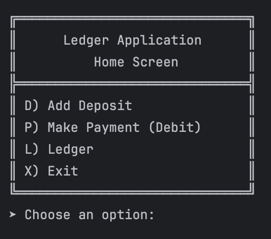
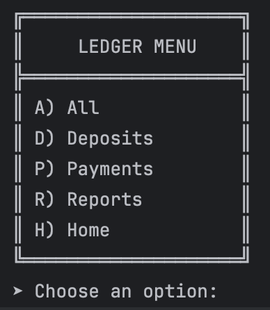
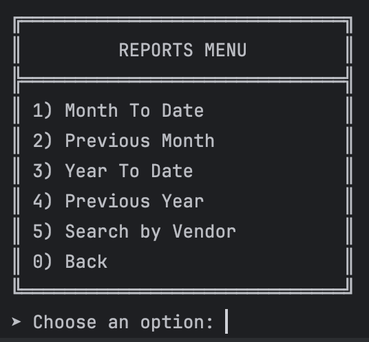
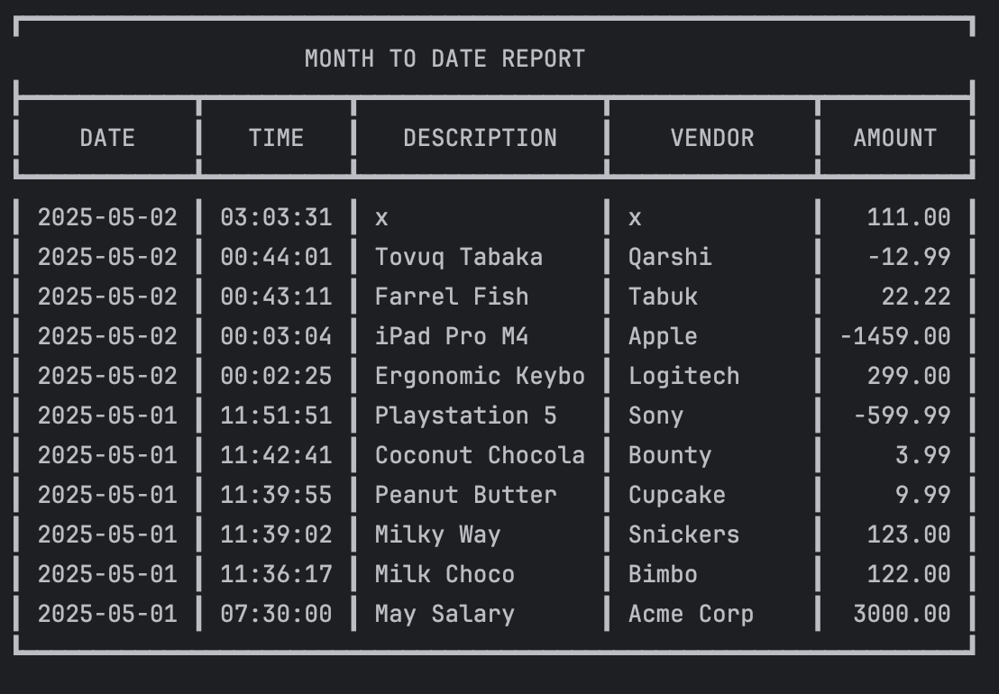

# 📒 Accounting Ledger Application

## 🖋️ Description
Welcome to my **first capstone project** for the Learn to Code Academy!  
This is a **Command-Line Interface (CLI)** application designed to **track financial transactions** for personal or business use.  
Users can easily **add deposits**, **record payments**, and **generate filtered ledger reports** by type, vendor, or date range.  
All transaction data is saved in a **CSV file**.

This project showcases my **Java development fundamentals** including:
- File input/output operations
- Command-line interaction
- User input handling
- Data filtering and reporting

---

## ✨ Application Features
- ➕ Add new deposits
- ➖ Record payments (debits)
- 📄 View full ledger (newest transactions first)
- 🔎 Filter ledger:
    - Deposits only
    - Payments only
- 📊 Generate reports:
    - Month-to-Date
    - Previous Month
    - Year-to-Date
    - Previous Year
    - Search by Vendor
- All transactions are automatically saved to the **`transactions.csv`** file in the project directory.

---

## 📸 Screenshots

### 🏠 Home Screen
Main menu with options to add deposits, make payments, view ledger, or generate reports.



---

### 📒 Ledger Menu
Filter transactions by all, deposits or payments. Or navigate to the reports section.



---

### 📈 Ledger: All
Demonstration of filter by all.


---

### 📈 Reports Menu
Options to generate reports by date, vendor, or run a summary.



---

### 📈 Month To Date Report
Demonstration of Month To Date Report



---

## ✨ Interesting Code Snippet: searchByVendor() method
```java
public static void searchByVendor(List<String> transactions, String vendor) {
    String searchTerm = vendor.trim().toLowerCase();
    boolean found = false;
    
    // Temporary list to hold matches for reversal (newest first)
    List<String> tempList = new ArrayList<>();
    
    // Process all transactions
    for (String transaction : transactions) {
        String[] parts = transaction.split("\\|");
        if (parts.length >= 4) {  // Safety check
            String transactionVendor = parts[3].trim().toLowerCase();
            
            // Case-insensitive partial match
            if (transactionVendor.contains(searchTerm)) {
                tempList.add(transaction);
                found = true;
            }
        }
    }
    
    // Reverse to show newest first
    Collections.reverse(tempList);

    if (!found) {
        System.out.println("\n⚠️  No transactions found for: " + vendor);
    }
}
```

---

## 💡 Why This Code is Interesting
This code searches transactions by vendor name—like "Amazon"—and:

- ✅ Finds matches flexibly – Works with any capitalization ("amazon", "AMAZON") and partial names ("ama" finds "Amazon").
- ✅ Organizes results smartly – Shows newest transactions first.
- ✅ Handles errors well – Checks data integrity and clearly says if nothing is found.
- ✅ Runs efficiently – Only processes relevant transactions without altering original data.

In short: A smart, user-friendly search that quickly finds what you need. 🚀

---

## 🗂️ Project Structure
```plaintext
AccountingLedgerApp/
├── src/
│   └── main/
│       └── java/
│           └── com/
│               └── pluralsight/
│                   ├── Main.java
│                   ├── Ledger.java
│                   ├── Transaction.java
│                   ├── TransactionHandler.java
│                   └── Reports.java
├── resources/
├── screenshots/
│       ├── code_snippet.png
│       ├── home_screen.png
│       ├── ledger_screen.png
│       ├── ledger_all.png
│       ├── reports_screen.png
│       └── reports_monthToDate.png
├── transactions.csv
├── Capstone-1_Document
├── .gitignore
├── README.md
├── pom.xml
└── LICENSE
```

---

## ⚙️ Technologies and Libraries Used
- ☕ Java 23
- 📂 Java File I/O (BufferedReader, BufferedWriter)
- 🕒 Java Time API (LocalDate, LocalTime)
- 🛠️ Maven (optional for dependency management)
- 🖥️ IntelliJ IDEA
- 🐙 Git & GitHub
- 📟 Command-Line Interface (CLI)

---

## Credits
- Instructor: Remsey M.
- Student: Khayotbek Azimov
- Class: Learn To Code Academy - Java Focus
- Learning Group: LG1
- Learning Class: LC1 Code-Blooded
- Date: May 2nd, 2025
- Program: YearUpUnited