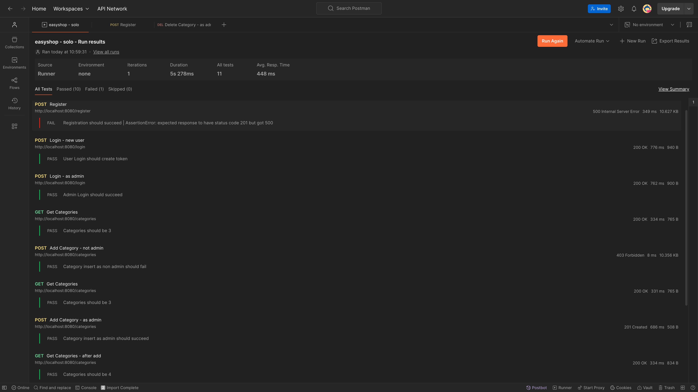

# EasyShop E-Commerce API

A comprehensive Spring Boot REST API for an e-commerce platform that provides backend services for product management, user authentication, shopping cart functionality, and order processing.

## 📋 Table of Contents

- [Project Overview](#-project-overview)
- [Features](#-features)
- [Technology Stack](#-technology-stack)
- [Getting Started](#-getting-started)
- [Database Setup](#-database-setup)
- [Authentication](#-authentication)
- [Testing](#-testing)
- [Project Structure](#-project-structure)
- [Development Phases](#-development-phases)
- [Screenshots](#-screenshots--loading)
- [Interesting Code Highlight](#-interesting-code-highlight)

## 🎯 Project Overview

EasyShop is a full-featured e-commerce API built with Spring Boot that serves as the backend for an online shopping platform. This project represents Version 2 of the EasyShop platform, featuring enhanced functionality including category management, product search/filtering, shopping cart operations, user profiles, and a complete checkout system.

The API supports role-based access control with separate permissions for regular users and administrators, ensuring secure operations for sensitive functions like product and category management.

## ✨ Features

### Core Functionality
- **User Authentication & Authorization** - JWT-based authentication with role-based access control
- **Product Management** - Full CRUD operations for products (Admin only)
- **Category Management** - Complete category system with admin controls
- **Advanced Search & Filtering** - Product search by category, price range, and color
- **Shopping Cart** - Persistent cart functionality for logged-in users
- **User Profiles** - User profile management and updates
- **Order Processing** - Complete checkout system converting carts to orders

### Security Features
- JWT token-based authentication
- Role-based authorization (USER/ADMIN)
- CORS configuration for frontend integration
- Secure password handling

### Additional Features
- RESTful API design
- MySQL database integration
- Comprehensive error handling
- Unit testing implementation
- Postman collection for API testing

## 🛠 Technology Stack

- **Backend Framework:** Spring Boot
- **Database:** MySQL
- **Authentication:** JWT (JSON Web Tokens)
- **Build Tool:** Maven
- **Testing:** JUnit, Postman
- **Documentation:** Postman Collections

## 🚀 Getting Started

### Prerequisites
- Java 11 or higher
- MySQL 8.0 or higher
- Maven 3.6 or higher
- IntelliJ IDEA or similar IDE
- Postman (for API testing)

### Installation

1. **Clone the repository**
   ```bash
   git clone https://github.com/xaetbek/LearnToCode_Capstones.git
   cd EasyShop-API-Debugging
   ```

2. **Set up the database**
   - Open MySQL Workbench
   - Execute the `create_database.sql` script located in the database folder
   - This will create the `easyshop` database with sample data

3. **Configure application properties**
   ```properties
   spring.datasource.url=jdbc:mysql://localhost:3306/easyshop
   spring.datasource.username=your_username
   spring.datasource.password=your_password
   ```

4. **Run the application**
   ```bash
   mvn spring-boot:run
   ```

The API will be available at `http://localhost:8080`

## 🗄 Database Setup

The database script creates the following tables:
- `users` - User authentication and basic info
- `profiles` - Extended user profile information
- `categories` - Product categories
- `products` - Product catalog
- `shopping_cart` - User shopping cart items
- `orders` - Order records
- `order_line_items` - Individual order items

### Sample Users
- **Admin User:** username: `admin`, password: `password`
- **Regular User:** username: `user`, password: `password`
- **Test User:** username: `george`, password: `password`


## 🔐 Authentication

The API uses JWT (JSON Web Tokens) for authentication. After successful login, include the token in the Authorization header:

```
Authorization: Bearer <jwt-token>
```

### Sample Login Response
```json
{
  "token": "eyJhbGciOiJIUzI1NiJ9...",
  "user": {
    "id": 2,
    "username": "admin",
    "authorities": [
      {
        "name": "ROLE_ADMIN"
      }
    ]
  }
}
```

## 🧪 Testing

### Postman Collections
Two Postman collections are provided:
- `easyshop.postman_collection.json` - Core functionality tests
- `easyshop-optional.postman_collection.json` - Optional features tests

### Running Tests
1. Import both collections into Postman
2. Create a new workspace for the project
3. Set up collection variables (userToken, adminToken, etc.)
4. Run the complete test suite to validate all endpoints

## 📁 Project Structure

```
src/
├── main/
│   ├── java/
│   │   └── org/yearup/
│   │       ├── controllers/    # REST controllers
│   │       ├── data/           # Data access layer
│   │       ├── models/         # Entity models
│   │       └── security/       # Authentication & authorization
│   └── resources/
│       └── application.properties
├── test/
│   └── java/                   # Unit tests
└── database/
    └── create_database.sql     # Database setup script
```

## 🔄 Development Phases

### Phase 1: Categories Controller - ✅
- Implemented complete CRUD operations for categories
- Added admin-only restrictions for modifications
- Created MySQL DAO implementation

### Phase 2: Bug Fixes - ✅
- **Bug 1:** Fixed product search/filtering logic
- **Bug 2:** Resolved product update issues causing duplicates
- Added comprehensive unit tests

### Phase 3: Shopping Cart 🛒  -  [LOADING...]
- To be implemented persistent shopping cart functionality
- To be added cart item management (add, update, remove)
- To be created cart-to-order conversion system

### Phase 4: User Profiles 👤 - ✅
- Added profile service with JWT authentication for GET/PUT profile endpoints
- Created beautified profile template with card-based responsive layout
- Implemented personal and address information sections with FontAwesome icons
- Added form validation and user-friendly input types (tel, email)
- Included hover effects, smooth transitions, and mobile-responsive design
- Integrated profile navigation in header with existing authentication system
- Added success/error messaging for profile update operations
  
### Phase 5: Checkout System 🛍  -  [LOADING...]
- To be created complete order processing system
- To be implemented cart-to-order conversion
- To be added order line item management

## 📸 Screenshots  -  [LOADING...]

### API Testing in Postman


### Frontend Integration


### Database Schema


### User Profile UI


## 💡 Interesting Code Highlight
```java
@GetMapping("")
@PreAuthorize("hasRole('USER') or hasRole('ADMIN')")
public Profile getProfile(Principal principal)
{
    try
    {
        // Get the currently logged-in user
        String userName = principal.getName();
        User user = userDao.getByUserName(userName);
        
        if (user == null)
            throw new ResponseStatusException(HttpStatus.NOT_FOUND, "User not found");

        // Get the user's profile
        Profile profile = profileDao.getByUserId(user.getId());
        
        if (profile == null)
            throw new ResponseStatusException(HttpStatus.NOT_FOUND, "Profile not found");

        return profile;
    }
    catch (ResponseStatusException ex)
    {
        throw ex;
    }
    catch (Exception ex)
    {
        throw new ResponseStatusException(HttpStatus.INTERNAL_SERVER_ERROR, "Oops... our bad.");
    }
}
```
**Why This Code is Interesting:**

🔐 **Multi-Layer Security Architecture**  
Demonstrates 3 security levels:
- `@PreAuthorize` - role-based access control
- `Principal` - extracts authenticated user from JWT
- Data ownership - users only see their own profiles

🎯 **Elegant Problem Solving**  
Solves: "How do users access only their data without exposing user IDs?"
- Traditional (vulnerable): `@GetMapping("/{userId}")`
- Our approach (secure): `getProfile(Principal principal)`

🔄 **JWT-to-Database Bridge**  
```java
String userName = principal.getName();  // Extract from JWT
User user = userDao.getByUserName(userName);  // Database lookup
Profile profile = profileDao.getByUserId(user.getId());  // Get user's data
```
Creates secure chain: JWT → Username → User ID → Profile Data

🛡️ **Defense in Depth**  
Multiple security layers protect data: Spring Security filters + `@PreAuthorize` + `Principal` + database ownership

This demonstrates production-ready, enterprise-level security with clean Spring Boot architecture!


## 👥 Authors

- **Khayotbek Azimov** - *Full Stack Software Engineer*

## Acknowledgments

- Remsey Mailjard - Pluralsight Instructor
- Pluralsight LearnToCode Java Development Bootcamp
- Spring Boot Documentation
- JWT.io for token debugging tools

## 📄 License

This project is licensed under the MIT License - see the [LICENSE.md](LICENSE.md) file for details.
